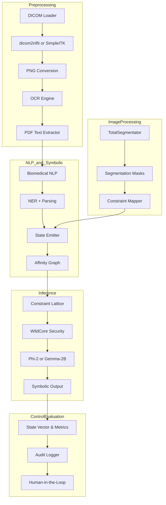

## Remote OHIF Access

The :mod:`msk_io.retrieval` package provides helpers for working with
web-based viewers. ``OHIFCanvasExtractor`` captures rendered frames using
a headless browser. ``DICOMStreamSniffer`` monitors network traffic to
download the original DICOM payloads. ``RemoteDICOMLoader`` combines both
methods and is triggered when ``remote_url`` and ``auth_token`` are set in
``PipelineSettings``.

## Local Chromium Setup

Some utilities rely on a headless Chromium browser. Run `./bootstrap_chromium.sh`
to ensure a compatible binary is available. The script checks for a system
installation and unpacks `resources/chromium/chromium.tar.xz` when needed. A
Python helper (`bootstrap_chromium.py`) provides the same behavior for
restricted environments.

## Automated Bootstrap

For air‑gapped execution ``bootstrap_pipeline.py`` orchestrates the entire
setup. It validates the local Chromium archive, extracts it through
``bootstrap_chromium.sh`` and runs the pipeline with ``MSK_REMOTE_URL`` and
``MSK_AUTH_TOKEN`` from the environment. Once ``resources/chromium/chromium.tar.xz``
is present, invoke it as:

```bash
MSK_REMOTE_URL="https://nbia.cancerimagingarchive.net/viewer/?study=..." \
MSK_AUTH_TOKEN="eyJhbGciOiJI..." \
python bootstrap_pipeline.py
```

## Quickstart

The following steps reproduce the offline pipeline described in the project whitepaper. They assume a Linux environment:

1. Create and activate a virtual environment:

   ```bash
   python3 -m venv venv
   source venv/bin/activate
   ```

2. Install dependencies. Prefer the editable install but fall back to the minimal list when the optional extras are unavailable:

   ```bash
   pip install -e .[dev] || \
   pip install pydantic-settings prometheus-client httpx fastapi numpy pydicom lmdb pillow nibabel pdfminer.six pyppeteer
   ```

3. Place a compatible `chromium.tar.xz` inside `resources/chromium/` if the system has no network access. Then bootstrap the browser with:

   ```bash
   ./bootstrap_chromium.sh  # or `python bootstrap_chromium.py`
   ```

4. Run the test suite to confirm the environment works:

   ```bash
   ./run_tests.sh
   ```

5. Export the remote OHIF url and token and launch the pipeline:

   ```bash
   export MSK_REMOTE_URL="https://nbia.example/viewer/123"
   export MSK_AUTH_TOKEN="<jwt-token>"
   python bootstrap_pipeline.py
   ```

## SMS Token Utilities

The repository includes `sms_module.py` which implements a basic SMS token flow. Use `python sms_module.py send <phone> <token>` to send an encoded token and `python sms_module.py receive <message>` to validate incoming messages.

